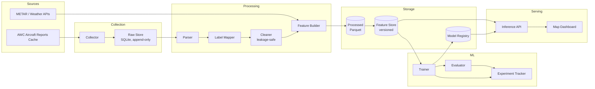
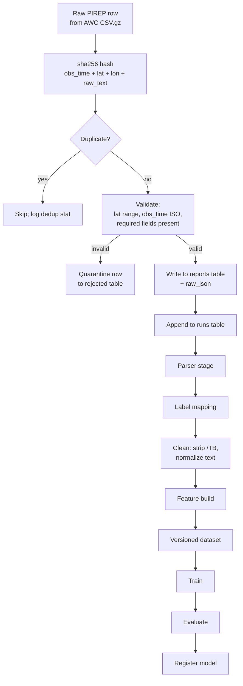
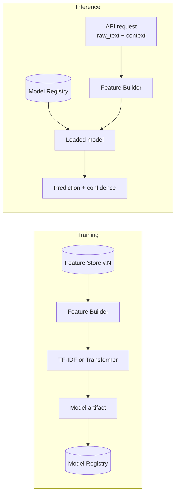
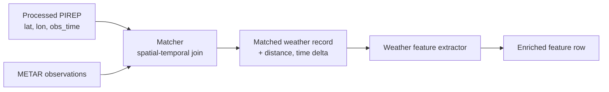

# Architecture

> Status: living document. Last revised at M0 entry.
> Owns: the system's vocabulary. Every other doc references the terms defined here.

---

## 1. Executive overview

### 1.1 Project vision

ChopCast is a research-grade system that turns operational pilot reports (PIREPs) into structured, geospatial, weather-aware intelligence about turbulence. It collects raw reports continuously, learns to classify turbulence severity from report text, plots the resulting observations on a map, and fuses them with atmospheric data to surface the weather signatures that drive rough air.

### 1.2 Research objective

Determine which textual, contextual, and atmospheric features are most predictive of moderate-to-severe turbulence, and quantify how much each contributes. The end state is a reproducible pipeline plus a documented set of findings — *not* an operational forecast product.

### 1.3 Engineering objective

Build a maintainable, testable, observable pipeline whose training and inference components are independent, whose raw inputs are immutable, and whose models can be swapped (TF-IDF baseline → transformer) without touching downstream code. See [ADR-0001](adr/0001-redesign-rationale.md) for the rationale behind starting from a clean structure rather than extending the original 3-file prototype.

### 1.4 Success criteria

| Dimension | Criterion |
|---|---|
| **Data** | ≥ 50,000 deduplicated PIREPs with usable turbulence labels, accrued continuously with no manual labeling. |
| **ML** | Baseline (TF-IDF + LogReg) macro-F1 ≥ 0.55 across the four severity classes on a held-out test set; transformer variant either matches or improves on it. |
| **Reproducibility** | Any committed model artifact can be regenerated from a committed dataset version with a single command. |
| **Engineering** | No source-of-truth duplication between training and inference; raw reports are write-once; new collectors can be added without changing the parser or trainer. |
| **Operational** | Collector runs unattended for ≥ 30 days with automatic retry, rate limiting, and data loss bounded to one polling cycle. |

---

## 2. System architecture

### 2.1 Component diagram

### 2.2 Data flow

### 2.3 ML pipeline (training vs. inference)

The same `chopcast.processing.pipeline.build_features()` function runs in both training and inference. The only difference is the source of input rows: in training, rows are read from the versioned feature store; in inference, rows arrive from the API.

The contract between feature builder and trainer is a `FeatureVector` dataclass. The contract between trainer and inference is a `Model` protocol with `predict` and `predict_proba`. Neither depends on the other's concrete implementation. See [ML_ARCHITECTURE.md](ML_ARCHITECTURE.md) §3.

### 2.4 Weather fusion pipeline

Matching is bounded by a maximum distance and time delta. Both bounds are configuration. Records that fail the bounds are kept with `weather_status="no_match"` rather than dropped, so the absence of weather data is itself a feature.

### 2.5 Component boundaries

| Component | Owns | Does NOT own |
|---|---|---|
| `collector` | Polling, transport, retry, raw row ingestion | Parsing, validation beyond transport, modeling |
| `parser` | Decoding PIREP strings, structured field extraction | Storage, label assignment |
| `labeling` | Mapping raw turbulence values to severity classes | Cleaning model input, training |
| `processing` | Cleaning, normalization, feature building | Storage layout, model choice |
| `training` | Model fitting, hyperparameter search, artifact writing | Data ingestion, serving |
| `evaluation` | Metrics, slicing, regression gates | Model selection, deployment |
| `inference` | Loading a registered model, serving predictions | Training, data acquisition |
| `weather` | Provider clients, matching, feature extraction | Storage of PIREP data |
| `api` | HTTP boundary, request validation, response shaping | ML logic |
| `dashboard` | Visualization, filtering | Data acquisition, model logic |

Boundaries are enforced by package layout: a module may only import from packages listed in the "Dependencies" column of [MODULE_DESIGN.md](MODULE_DESIGN.md). Lint rule in `pyproject.toml` rejects upward imports.

---

## 3. Design principles

The system follows five principles. Every architectural decision is checked against them.

1. **Raw is immutable.** A row in `reports` is never updated or deleted except by a versioned migration. If extraction logic is wrong, we re-extract from raw — we never rewrite raw.
2. **Training and inference share contracts, not code paths.** Both go through the same `build_features()` entry point and the same `Model` protocol. We do not have a "training-only" code path that diverges silently.
3. **No label leakage, by construction.** The `/TB` field is removed from the model input at the cleaning stage, before any feature is built. There is no codepath that allows raw text to reach a trainer before cleaning. The `processing.cleaner` module is the *only* function that takes raw text and returns clean text; it is enforced by a unit test that walks the call graph.
4. **Configuration over hardcoding.** Every URL, threshold, model name, and feature flag is loaded from a typed config object. There are no string literals for behavior inside `chopcast/*`.
5. **Test-first on the things that bite.** Dedup logic, label mapping, leakage removal, and weather matching are tested before any UI work begins. The collector is the data source; if it lies, every model is wrong.

---

## 4. Cross-cutting concerns

### 4.1 Time

All timestamps are stored in UTC ISO 8601 with explicit `+00:00` offset (never `Z` and never naive). The collection layer is the only place that converts from AWC's local formats; everything downstream assumes UTC.

### 4.2 Identity

A report is identified by a SHA-256 hash of `obs_time | lat | lon | raw_text`. The hash is computed at ingestion and stored as the primary key. The hash is *content-addressed*: the same report from any source gets the same id. See [DATA_ENGINEERING.md](DATA_ENGINEERING.md) §3.

### 4.3 Versioning

Three things are versioned: datasets (the feature store), models, and configs. Versions are explicit (`v1`, `v2`, …) and referenced by id in the model registry and experiment tracker. Implicit versioning ("whatever's in the table") is forbidden.

### 4.4 Observability

The collector and the inference API emit structured JSON logs. Every pipeline run writes a manifest with input hash, output hash, code version, and config version. A failed run writes the same manifest with `status="failed"` and the traceback.

---

## 5. What lives in the repo

| Path | Purpose | Authoritative doc |
|---|---|---|
| `chopcast/` | Source code, organized by component. | [MODULE_DESIGN.md](MODULE_DESIGN.md) |
| `configs/` | YAML configuration for every component. | [CONFIGURATION.md](CONFIGURATION.md) |
| `data/` | DVC-tracked datasets (raw, processed, features). | [DATA_ENGINEERING.md](DATA_ENGINEERING.md) |
| `models/` | Registered model artifacts and metadata. | [ML_ARCHITECTURE.md](ML_ARCHITECTURE.md) |
| `tests/` | Unit, integration, golden, regression tests. | [TESTING.md](TESTING.md) |
| `docs/` | This tree. | — |
| `docs/adr/` | Architecture Decision Records. | [docs/adr/](adr/) |
| `notebooks/` | Exploratory analysis. Never used to ship models. | — |
| `scripts/` | Operational scripts (backup, migration). | [DATA_ENGINEERING.md](DATA_ENGINEERING.md) |
| `pyproject.toml` | Package definition, deps, lint, test config. | [STANDARDS.md](STANDARDS.md) |

---

## 6. Glossary

| Term | Definition |
|---|---|
| **PIREP** | Pilot Report. Free-text, structured aviation weather observation. |
| **AIREP** | Automated aircraft report. Often lacks useful prose; usually excluded from the text classifier. |
| **Raw report** | One row in `reports`, content-addressed by hash. Immutable. |
| **Processed report** | A raw report with structured fields parsed, labels mapped, but not yet featurized. |
| **Feature row** | The numeric/embedding input to a model. |
| **Severity label** | One of `None`, `Light`, `Moderate`, `Severe`. Derived from the raw turbulence value by `labeling`. |
| **Leakage** | Information from the label being present in the model input. The single most important failure mode. |
| **Feature store** | Versioned Parquet of feature rows, keyed by report hash. |
| **Model registry** | Versioned model artifacts with metrics, training config, and feature store version. |
