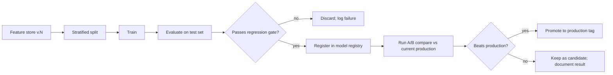

# Machine Learning Architecture

> Authoritative for `chopcast.training`, `chopcast.models`, `chopcast.evaluation`, `chopcast.registry`. See [MODULE_DESIGN.md](MODULE_DESIGN.md) for module-level responsibilities and [DATA_ENGINEERING.md](DATA_ENGINEERING.md) for the input pipeline.

---

## 1. Goals

1. A baseline model that beats the majority-class floor and is reproducible from a single command.
2. A `Model` protocol that lets us swap a TF-IDF baseline for a DistilBERT classifier without changing anything downstream.
3. An evaluation harness that catches regressions before they ship.
4. An experiment tracker that lets us compare runs without spelunking through log files.
5. A model registry that knows which feature version, code commit, and config produced which artifact.

---

## 2. The Model protocol

The single most important design decision in this subsystem: every model implements the same protocol. Downstream code (the API, the dashboard, the evaluator) depends on the protocol, not on a concrete class.

```python
# chopcast/models/protocol.py
from typing import Protocol, runtime_checkable
import numpy as np

@runtime_checkable
class Model(Protocol):
    feature_version: str
    model_version: str
    model_kind: str  # "baseline" | "transformer"

    def predict(self, X: "np.ndarray | list[str]") -> np.ndarray: ...
    def predict_proba(self, X: "np.ndarray | list[str]") -> np.ndarray: ...
    def classes(self) -> list[str]: ...   # ["None", "Light", "Moderate", "Severe"]
```

A test asserts that both `BaselineSklearn` and `TransformerDistilBERT` satisfy this protocol at runtime. A new model that does not satisfy it cannot be registered.

The benefit: the inference API does not know whether it is serving a logistic regression or a 66M-parameter transformer. The feature builder does not know. The dashboard does not know. The only place that knows is the registry entry that produced the loaded object.

---

## 3. Pipeline



### 3.1 Feature store → training set

```python
# chopcast/training/split.py
@dataclass(frozen=True)
class Split:
    train_hashes: list[str]
    test_hashes: list[str]
    version: str           # split version
    seed: int
    created_at: datetime
    config_version: str
```

A split is content-addressed: given the same feature store version and the same seed, the split is byte-identical. The split manifest is committed next to the model artifact. Trainers and evaluators reference the split by `version`, not by re-splitting.

### 3.2 Stratification

Stratification is by `severity_label`. The minor classes (`Moderate`, `Severe`) are split at the same ratio as the rest. When a class has fewer than 10 members, the split is rejected and the user is told to collect more data.

### 3.3 Split leakage checks

Before training, a check asserts that no report appears in both train and test. The check is part of the trainer's first step and is logged. The split manifest itself contains a `hash(train_hashes) + hash(test_hashes)` so a quick equality check is possible.

### 3.4 Geographic / temporal leakage

A random split is acceptable as a baseline but can leak: a test report 50 km from a training report at the same time is nearly identical. We support two optional split modes:

- **Time-based:** all reports before `T` go to train, all after to test. Captures temporal drift.
- **Spatiotemporal:** reports are bucketed by 1°×1° grid and hour; entire buckets are assigned to one split. Captures spatial correlation.

For the baseline we use random with stratification. The spatiotemporal mode is exercised in M3 as a regression test; if it gives materially different metrics, we switch.

---

## 4. Label generation

Labels are produced by `chopcast.labeling`, *not* inside the trainer. The trainer receives them.

### 4.1 Severity classes

| Class | Examples of raw turbulence values |
|---|---|
| `None` | `NEG`, missing, `TB NIL`, `SMOOTH` |
| `Light` | `LGT`, `LGT CHOP` |
| `Moderate` | `MOD`, `LGT-MOD`, `OCNL MOD`, `MOD CHOP` |
| `Severe` | `SEV`, `MOD-SEV`, `EXTRM`, `SEV CHOP` |

### 4.2 Combination handling

For combined values like `LGT-MOD`, take the maximum severity. `LGT-MOD` → `Moderate`. This rule is in `configs/labeling.yaml`, not in code, so we can revise it without redeploying.

### 4.3 Edge cases

- **Empty turbulence** with non-empty prose: the prose may describe conditions. We do not infer a label from the prose at this stage. The label is `None`; the row is excluded from text classification training but retained for analysis.
- **`CHOP` without severity** (e.g., `RM CHOP`): we treat as `Light` if the report explicitly says "chop," and `None` otherwise. The decision is in `configs/labeling.yaml` under `chop_only:`.
- **Multiple turbulence values in one report:** rare; the parser takes the first.

### 4.4 Label versioning

Every processed dataset records `labeler_version`. Changing the labeling rules is a content-breaking change that requires a new feature store version. The labeler never operates on already-labeled data; it always starts from `raw.turbulence`.

---

## 5. Feature engineering

### 5.1 Text features

For the baseline:
- `TfidfVectorizer` with `ngram_range=(1,2)`, `min_df=5`, `max_df=0.95`, `sublinear_tf=True`.
- Aviation stop words list applied before vectorization. The list is in `configs/text.yaml`.
- Text is `clean_text` from the processed layer; `/TB` is already removed.

For the transformer:
- `AutoTokenizer.from_pretrained("distilbert-base-uncased")` with `max_length=128`.
- Truncation strategy: head + tail, because PIREP turbulence mentions often appear at the end (`/TB` is the *removed* part, but `RM CHOP` may be at the tail).

### 5.2 Context features

- `altitude_band`: one of `<FL200`, `FL200–FL300`, `FL300–FL400`, `>FL400`. Bucketed to reduce overfit to specific flight levels.
- `aircraft_type`: as parsed from `/TP`. Unknown aircraft get a special token.
- `report_type`: `PIREP`, `AIREP`, or `unknown`.
- `hour_of_day`, `day_of_year`: cyclic features (sin/cos).

### 5.3 Weather features (M6)

- `wind_speed`, `wind_dir`, `temperature`, `pressure`, `dewpoint`, `visibility`, `ceiling`.
- `weather_status`: `matched`, `no_match`, `quarantined`. The status is itself a feature.
- `match_distance_km`, `match_dt_minutes`: the matching metadata, available for analysis.

### 5.4 Feature hashing

The `FeatureRow` dataclass is hashed deterministically. Re-running `build_features` on the same input produces a byte-identical output. This is what makes the regression test in §7.3 work.

---

## 6. Class imbalance

Severe turbulence is rare. A naive model will predict `None` for everything and look 85% accurate.

### 6.1 Mitigation

- **Class weights:** `LogisticRegression(class_weight="balanced")`. The exact weight is logged per class.
- **Threshold tuning:** per-class thresholds on `predict_proba` chosen on a held-out validation set to maximize macro-F1.
- **Resampling:** SMOTE is *not* used by default because it manufactures synthetic minority examples. It is available behind a flag and is exercised as a regression test.

### 6.2 Reporting

We report macro-F1, weighted-F1, per-class precision/recall/F1, and the confusion matrix. We do **not** report accuracy as the headline number. A regression in any class's recall is treated as a defect, even if overall F1 is unchanged.

---

## 7. Training

### 7.1 Baseline

```python
# chopcast/training/baseline.py
def train_baseline(
    X_train: list[str],
    y_train: list[str],
    config: BaselineConfig,
) -> Model:
    ...
```

Inputs are pure data. No file paths, no SQL. The trainer does not know where the data came from; it takes a `Split` and returns a `Model`. This makes the trainer testable in isolation and lets us run it from notebooks or scripts interchangeably.

### 7.2 Hyperparameters

Default hyperparameters live in `configs/baseline.yaml`. They are loaded into a `BaselineConfig` dataclass. Sweeps are run via `chopcast-train sweep --config configs/sweep.yaml`. Each sweep trial produces a separate model registry entry.

### 7.3 Reproducibility

A model artifact is reproducible from `(feature_store_version, config_version, code_commit)`. The registry records all three. Re-running the trainer with these three values produces a byte-identical artifact (verified in CI by replaying one registry entry per release).

We pin:
- `scikit-learn` exact version
- `numpy` exact version
- `random_state` everywhere
- `PYTHONHASHSEED` is set in the training entry point

We do not pin `pandas` or `torch` for the baseline (they are not used), but we do pin them for the transformer trainer.

### 7.4 Artifact contents

A model directory looks like:

```
models/registry/baseline-v3/
├── model.pkl                  # the fitted estimator (joblib)
├── vectorizer.pkl             # the fitted TF-IDF vectorizer
├── config.json                # training config, including feature store version
├── metrics.json               # test-set metrics
├── confusion_matrix.png
├── classification_report.txt
├── lineage.json               # inputs and commit
└── model_card.md              # human-readable description
```

The vectorizer is stored alongside the model. Loading the model and vectorizing new text is one function: `chopcast.registry.store.load("baseline-v3")`.

---

## 8. Evaluation

### 8.1 Metrics

| Metric | Why |
|---|---|
| Macro-F1 | Treats classes equally; the headline number. |
| Weighted-F1 | Tells us if we are doing well on the majority class. |
| Per-class precision, recall, F1 | Reveals which class the model is failing on. |
| Confusion matrix | Reveals *which* classes are confused. |
| Per-class support | Reminds us we may be evaluating on 12 examples. |

### 8.2 Slicing

After the headline metrics, we slice on:
- `altitude_band`
- `report_type` (PIREP vs AIREP)
- `aircraft_type`
- `weather_status` (M6+)
- text length bucket

A model that improves overall F1 by degrading the `Severe`-class recall on PIREPs is not promoted. The slicing report is part of the model card.

### 8.3 Regression gate

`tests/evaluation/test_regression.py` maintains a fixture: a small, fixed feature store with a small, fixed split, against an expected metrics report. Any change that moves the metrics by more than 0.005 (5 decimal macro-F1) on the fixture fails the test. This catches accidental breakage from a sklearn upgrade or a refactor.

### 8.4 Comparison

`chopcast-eval compare baseline-v3 transformer-v2` produces a side-by-side report:

| Metric | baseline-v3 | transformer-v2 | Δ |
|---|---|---|---|
| Macro-F1 | 0.612 | 0.640 | +0.028 |
| Severe recall | 0.21 | 0.34 | +0.13 |
| Inference latency (p95) | 8 ms | 92 ms | — |

The report is committed next to the model artifacts.

---

## 9. Experiment tracking

A "tracking system" need not be MLflow. For this project's scale, a local manifest is enough:

```
runs/
├── 2026-08-22_baseline_tfidf/
│   ├── config.yaml
│   ├── metrics.json
│   ├── notes.md
│   └── stdout.log
```

A run is created by `chopcast-train run --config configs/baseline.yaml` and is uploaded to a remote location only if a remote is configured. The tracker records start time, end time, config hash, code commit, exit status, and metrics.

If we later need richer tracking (e.g., artifact storage, hyperparameter search UI), we can swap in MLflow without changing trainer code, because the trainer only writes a `Run` dataclass to a sink.

---

## 10. Model registry

The registry is an append-only log. Entries are never modified or deleted. Promotion is a tag, not an edit.

### 10.1 Schema

```sql
CREATE TABLE models (
    id              TEXT PRIMARY KEY,    -- "{kind}-v{N}"
    kind            TEXT NOT NULL,       -- baseline | transformer
    version         INTEGER NOT NULL,
    created_at      TEXT NOT NULL,
    feature_version TEXT NOT NULL,       -- feature store version
    split_version   TEXT NOT NULL,
    config_version  TEXT NOT NULL,
    code_commit     TEXT NOT NULL,
    artifact_path   TEXT NOT NULL,
    metrics_json    TEXT NOT NULL,
    promoted_at     TEXT,
    is_production   INTEGER NOT NULL DEFAULT 0
);
```

### 10.2 Promotion

```bash
chopcast-registry promote baseline-v3 --tag production
```

Promotion sets `is_production=0` on the previous production model and `is_production=1` on the new one. The API loads `is_production=1`. There is exactly one production model per kind.

### 10.3 Loading

```python
model = registry.load_production("baseline")
# or
model = registry.load("baseline-v3")
```

`load_production` is the path used by the API. It is fast (a single SQL query) and never blocks training. Training never reads the production model; it reads from the registry history.

---

## 11. Putting it together

```python
# chopcast/training/cli.py
@app.command()
def run(config_path: Path) -> None:
    config = BaselineConfig.from_yaml(config_path)
    feature_store = FeatureStore.load(config.feature_version)
    split = Split.load(config.split_version)

    model = train_baseline(
        feature_store.text_for(split.train_hashes),
        feature_store.labels_for(split.train_hashes),
        config,
    )

    metrics = evaluate(
        model,
        feature_store.text_for(split.test_hashes),
        feature_store.labels_for(split.test_hashes),
    )

    model_id = registry.register(model, config, metrics)
    gate.check(metrics)  # raises if regression
    log.info("Registered %s with macro-F1=%.3f", model_id, metrics.macro_f1)
```

The CLI is a thin wrapper. The actual work is in `train_baseline` and `evaluate`, both of which are testable without a CLI.
